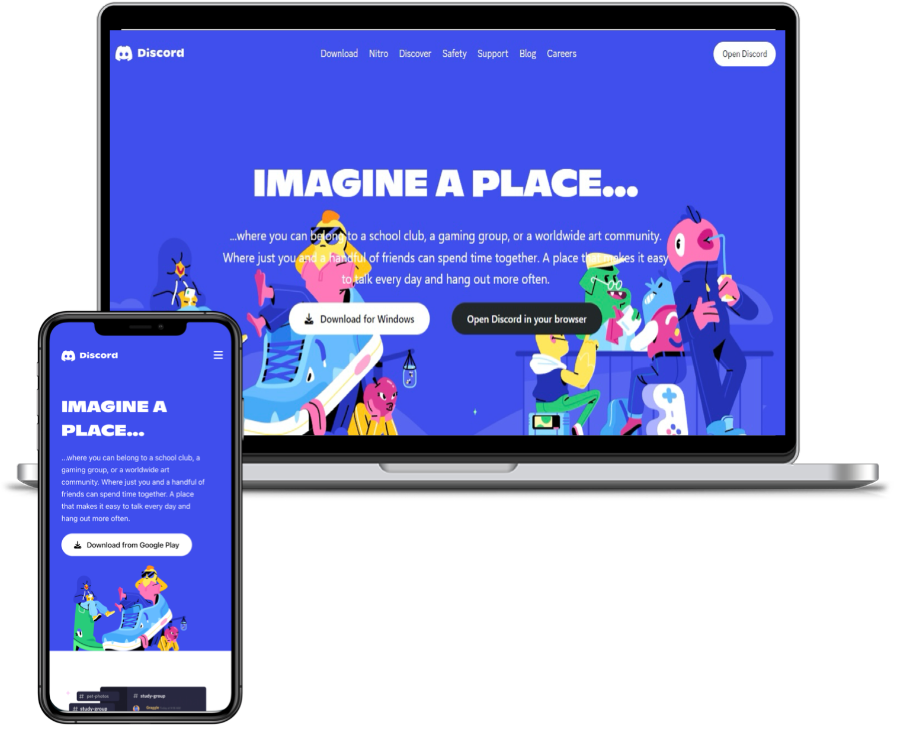

<h1>Discord frontend - v0.1.0</h1>

<h2>
  <a href="https://discord-intakhab.netlify.app/">discord.netlify.app</a>
</h2>

  

 

⭐ Star this repo on GitHub — it helps!

## Features 📋

⚡️ Complete frontend UI implementation\
⚡️ Tailwind CSS\
⚡️ Fully Responsive\
⚡️ Valid HTML5 & CSS3 & JS\
⚡️ Typing animation\

## Sections 📚

✔️ Home\
✔️ Navbar \
✔️ Main section \
✔️ Features\
✔️ Core features\
✔️ Footer

To view a live example, **[click here](https://discord-intakhab.netlify.app/)**

## Tools Used 🛠️

- [**Netlify**](https://www.netlify.com/) - To host my static website (HTML, CSS, JS).
- [**Tailwind CSS**](https://tailwindcss.com/) - For responsive , fast and reliable experience.
- [**Font Awesome**](https://fontawesome.com/) - A font and icon toolkit based on CSS.
- [**Iconscout**](https://iconscout.com/unicons) - Ready-to-use high-quality SVG icons.

## Contributing 💡

#### Step 1

- 🍴 Fork this repo!
- 👯 Clone this repo to your local machine.

#### Step 2

- Build your code 🔨🔨🔨

#### Step 3

- 🔃 Create a new pull request.
